<picture>
  <source media="(prefers-color-scheme: dark)" srcset="./dark.svg">
  
</picture>

  
  
  

---

### 👋 About

**Full-Stack JavaScript Developer with 7+ years of experience**, from teaching the first line of React to a classroom to architecting an AI-native platform from scratch as the sole engineer. Comfortable owning a product end-to-end — UI, APIs, data modeling, infra and everything in between.

- 🧱 **Full-stack:** React, Next.js, TypeScript on the frontend; Node.js, Express, Nest.js on the backend
- 🗄️ **Data:** PostgreSQL, MongoDB, Redis, pgvector — schema design through query optimization
- 🤖 **AI/RAG:** Production RAG pipelines with the Claude API and vector search — deterministic rule engines to keep AI features hallucination-safe
- ☁️ **Infra:** AWS (EC2, S3, IAM), Docker, Kubernetes, CI/CD
- 🏗️ **Architecture:** Feature-Sliced Design, monolith → microservices migrations, RBAC and multi-tenant data isolation
- 🎓 **Mentoring:** Founded and ran a coding school (CEO, Cube Solutions), taught 400+ students the MERN stack

---

### 🛠 Tech Stack

**Frontend**

**Backend**

**Databases & AI**

**Cloud & DevOps**

---

### 🚀 Experience Highlights

**Founding Full-Stack Engineer / System Architect** — Orange-Lab · 2026–present
Architected an AI-native platform from scratch as the sole engineer — Next.js/Express/PostgreSQL monorepo, a hybrid AI triage + RAG pipeline (Claude API + pgvector), and privacy-first 4-tier RBAC.

**Frontend & Mobile Developer** — VECTO Digital · 2025–2026
Shipped Sentigraph AI and Athletes411 (Next.js, React Native, Node.js, MongoDB); integrated Claude API with a RAG pipeline for context-aware AI features and introduced Cursor AI into the team's workflow.

**Technical Lead / Full-Stack Developer** — AraratChess LLC · 2024–2025
Led a remote team, split a monolith into microservices, introduced Feature-Sliced Design, and managed AWS-based production infrastructure.

*Full work history → [LinkedIn](https://www.linkedin.com/in/edgar-nikoghosjan)*
